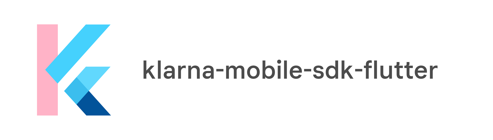

# Klarna In-App Flutter Plugin



> Klarna's Flutter wrapper for the In-App SDK

[![Build Status][ci-image]][ci-url]
[![License][license-image]][license-url]
[![Developed at Klarna][klarna-image]][klarna-url]

**Looking for the pure native Klarna In-App SDK?** Check out the [Klarna In-App SDK](https://github.com/klarna/klarna-inapp-sdk) repo instead.

**Looking for the React Native Klarna In-App SDK?** Check out the [React Native Klarna In-App SDK](https://github.com/klarna/react-native-klarna-inapp-sdk) repo instead.

## Integration

### Requirements
* iOS 9 or later.
* Android 4.4 or later.

### Supported Products

- :white_check_mark: Klarna Post Purchase Experience
- :x: Klarna Payments
- :x: Klarna Checkout

#### Post Purchase Experience

As of now, credentials needed for Post Purchase Experience is only available through Klarna Delivery Managers. If you want to test this integration, please contact your Delivery Manager to get required information regarding Post Purchase Experience.

### Klarna In-App SDK Documentation
[Overview of the SDK](https://developers.klarna.com/documentation/in-app/)

### Flutter Dependency

Add `flutter_klarna_inapp_sdk` as a dependency in your `pubspec.yaml` file according to the [official documentation](https://flutter.dev/docs/development/packages-and-plugins/using-packages#adding-a-package-dependency-to-an-app).

### Usage

#### KlarnaHybridSDK

##### initialize()

Initializes a KlarnaHybridSDK instance which will also be used for Post Purchase operations.

###### Parameters
| Name | Type | Description |
| ---- | ---- | ----------- |
| returnUrl | `String` | An app-defined URL scheme the component uses to return customers to your app. | 

##### registerEventListener()
Registers a listener, receiving merchant events from Klarna web components.

###### Parameters
| Name | Type | Description |
| ---- | ---- | ----------- |
| listener | `Function(String)` | A listener function receiving the event body string as a parameter. | 

#### KlarnaPostPurchaseExperience

##### initialize()

Initializes new `WebView` and javascript Klarna Post Purchase Experience library.

###### Parameters
| Name | Type | Description |
| ---- | ---- | ----------- |
| locale | `String` | A string representing the user locale. For example: `se-SE` | 
| purchaseCountry | `String` | A string representing the purchase country. For example: `SE` | 
| design | `named optional` `String?` | A string representing the design ID. | 
| environment | `named optional` `KlarnaPostPurchaseEnvironment?` | Region or playground environment for Post Purchase SDK. | 

##### destroy()

Destroys any object, including `WebView` attached to the client.

##### renderOperation()

Load the Klarna widget for the operation.

###### Parameters
| Name | Type | Description |
| ---- | ---- | ----------- |
| locale | `named optional` `String?` | A string representing the user locale. | 
| operationToken | `String` | The operation token for the related order returned from the post purchase api. |

##### authorizationRequest()

Called to kick off the oauth flow.

###### Parameters
| Name | Type | Description |
| ---- | ---- | ----------- |
| locale | `named optional` `String?` | A string representing the user locale. | 
| clientId | `String` | The client_id for your application. | 
| scope | `String` | A space-delimited list of scopes that identify the resources that your application could access on the user's behalf. These values define the consent screen that Klarna displays to the user. | 
| redirectUri | `String` | The “location” where the OAuth server redirects the user after the user completes the authorization flow. The value must exactly match one of the redirect_url values provided to Klarna in advance. | 
| state | `named optional` `String?` | A string value that your application uses to maintain state between your authorization request and the authorization server's response. The Authorization server returns the exact value that you send to the redirect_url as a URL parameter. | 
| loginHint | `named optional` `String?` | If your application knows which user is trying to authenticate, it can use this parameter to provide a hint to the Klarna’s Authorization Server. The server uses the hint to simplify the login flow by prefilling the email field in the sign-in form. It’s recommended to use this as it will improve the customer experience. | 
| responseType | `named optional` `String?` | The desired grant type. The value MUST be one of "code" for requesting an authorization code or "token" for requesting an access token (implicit grant). The default is "code" | 


## Development

### Getting Started

After cloning the repository run the command below to setup the project.
```shell script
flutter packages get
```

#### Android Studio

1. Execute `cd example; flutter build apk`
2. Import the `example/android/build.gradle` file or open `example/android` folder from Android Studio.

Plugin implementation will be located at `flutter_klarna_inapp_sdk/java/com.klarna.inapp.sdk.flutter_klarna_inapp_sdk/`.

#### XCode

1. Execute `cd example; flutter build ios --no-codesign`
2. Import the `example/ios/Runner.xcworkspace` file from XCode.

Plugin implementation will be located at `Pods/Development Pods/flutter_klarna_inapp_sdk/../../example/ios/.symlinks/plugins/flutter_klarna_inapp_sdk/ios/Classes`.


## Support

If you are having any issues using the SDK in your project or if you think that something is wrong with the SDK itself, please create an issue on [Github](https://github.com/klarna/flutter-klarna-inapp-sdk/issues) or report a bug by following the guidelines in the next section. 

### How can I contribute?

Thank you for reading this and taking the time to contribute to Klarna In-App SDK! Below is a set of guidelines to help you contribute whether you want to report a bug, come with suggestions or modify code.

#### Reporting Bugs
This section will guide you through submitting a bug report for Klarna In-App SDK.

Before submitting a bug report, please check that the issue hasn't been reported before. If you find a *Closed* issue that seems to describe an issue that is similar to what you want to report, open a new issue and link to the original issue in the new one. When you have checked that the issue hasn't been reported before, please **fill out [the required template](https://github.com/klarna/flutter-klarna-inapp-sdk/blob/master/.github/ISSUE_TEMPLATE/bug_report.md)** which will help us resolve the issue faster. 

##### Submitting a Bug Report
Submitted bugs are tracked as [GitHub issues](https://guides.github.com/features/issues/). To report a bug, create an issue and use [the template](https://github.com/klarna/flutter-klarna-inapp-sdk/blob/master/.github/ISSUE_TEMPLATE/bug_report.md) to provide information about the bug. Explain the problem thoroughly and include any additional information that you think might help the maintainers reproduce the issue. When creating the GitHub issue please make sure that you:

* **Use a clear and descriptive title** for the issue.
* **Describe the exact steps which reproduce the problem** with as many details as possible. It's generally better to provide too much than too little information.
* **Describe the behavior you observed after following the steps** and explain precisely what the problem is with that behavior.
* **Explain which behavior you expected instead** and why.
* **Provide screenshots and/or screen recordings** that might help explain the issue you are facing. To screen record a phone connected to Android Studio or an emulator, follow the steps [here](https://developer.android.com/studio/debug/am-video). To screen record on iOS, follow the steps described [here](https://support.apple.com/en-us/HT207935).
* **Include relevant logs in the bug report** by putting it in a [code block](https://help.github.com/en/github/writing-on-github/getting-started-with-writing-and-formatting-on-github#multiple-lines), a [file attachment](https://help.github.com/en/github/managing-your-work-on-github/file-attachments-on-issues-and-pull-requests) or in a [gist](https://help.github.com/en/github/writing-on-github/creating-gists) and provide a link to that gist.
* **Tell how recently you started having the issue.** When was the first time you experienced the issue and was it after updating the SDK version? Or has it always been a problem?
* If the problem started happening recently, **can you reproduce it in an older version of the SDK?** What's the most recent version in which the problem doesn't happen?
* **Can you reliably reproduce the issue?** If not, explain how often it occurs and under what conditions it usually happens. For example, in what environment you are running.

Include details about the device/emulator/simulator you are experiencing the issue on:

* **Which version of the SDK are you using?**
* **Which OS is this a problem in, iOS, Android or both?** What version(s)? Also, add the appropriate label to the issue.
* **Did you experience the issue in simulator/emulator or on real device(s)?**

## Contribution

Before contributing, please read through the [Klarna In-App SDK documentation](https://developers.klarna.com/documentation/in-app/).

##### Branching
Prefix the branch you are going to work on depending on what you are working on (bug fix or feature). Use the following prefixes when creating a new branch:

* **feature/** if the branch contains a new feature, for example: `feature/my-shiny-feature`.
* **bugfix/**  if the branch contains a bug fix, for example: `bugfix/my-bug-fix`.

##### Pull Requests
When creating a PR, please include as much information as possible about the type of enhancement, whether if it's a bugfix, new functionality, or any other change. There's [a template](https://github.com/klarna/flutter-klarna-inapp-sdk/blob/master/.github/ISSUE_TEMPLATE/pull-request.md) for you to fill out, which will make the review process for the maintainers faster. When creating a PR do it against the `master` branch. The PR should include:

* **A clear and descriptive title**.
* **Description of the issue** if you are fixing a bug together with a link to the relevant issue or **background for introducing a new feature**.

<!-- Markdown link & img dfn's -->
[ci-image]: https://img.shields.io/badge/build-passing-brightgreen?style=flat-square
[ci-url]: https://github.com/klarna/TODO
[license-image]: https://img.shields.io/badge/license-Apache%202-blue?style=flat-square
[license-url]: http://www.apache.org/licenses/LICENSE-2.0
[klarna-image]: https://img.shields.io/badge/%20-Developed%20at%20Klarna-black?labelColor=ffb3c7&style=flat-square&logo=data:image/png;base64,iVBORw0KGgoAAAANSUhEUgAAABAAAAAOCAYAAAAmL5yKAAAAAXNSR0IArs4c6QAAAIRlWElmTU0AKgAAAAgABQESAAMAAAABAAEAAAEaAAUAAAABAAAASgEbAAUAAAABAAAAUgEoAAMAAAABAAIAAIdpAAQAAAABAAAAWgAAAAAAAALQAAAAAQAAAtAAAAABAAOgAQADAAAAAQABAACgAgAEAAAAAQAAABCgAwAEAAAAAQAAAA4AAAAA0LMKiwAAAAlwSFlzAABuugAAbroB1t6xFwAAAVlpVFh0WE1MOmNvbS5hZG9iZS54bXAAAAAAADx4OnhtcG1ldGEgeG1sbnM6eD0iYWRvYmU6bnM6bWV0YS8iIHg6eG1wdGs9IlhNUCBDb3JlIDUuNC4wIj4KICAgPHJkZjpSREYgeG1sbnM6cmRmPSJodHRwOi8vd3d3LnczLm9yZy8xOTk5LzAyLzIyLXJkZi1zeW50YXgtbnMjIj4KICAgICAgPHJkZjpEZXNjcmlwdGlvbiByZGY6YWJvdXQ9IiIKICAgICAgICAgICAgeG1sbnM6dGlmZj0iaHR0cDovL25zLmFkb2JlLmNvbS90aWZmLzEuMC8iPgogICAgICAgICA8dGlmZjpPcmllbnRhdGlvbj4xPC90aWZmOk9yaWVudGF0aW9uPgogICAgICA8L3JkZjpEZXNjcmlwdGlvbj4KICAgPC9yZGY6UkRGPgo8L3g6eG1wbWV0YT4KTMInWQAAAVBJREFUKBVtkz0vREEUhsdXgo5qJXohkUgQ0fgFNFpR2V5ClP6CQu9PiB6lEL1I7B9A4/treZ47c252s97k2ffMmZkz5869m1JKL/AFbzAHaiRbmsIf4BdaMAZqMFsOXNxXkroKbxCPV5l8yHOJLVipn9/vEreLa7FguSN3S2ynA/ATeQuI8tTY6OOY34DQaQnq9mPCDtxoBwuRxPfAvPMWnARlB12KAi6eLTPruOOP4gcl33O6+Sjgc83DJkRH+h2MgorLzaPy68W48BG2S+xYnmAa1L+nOxEduMH3fgjGFvZeVkANZau68B6CrgJxWosFFpF7iG+h5wKZqwt42qIJtARu/ix+gqsosEq8D35o6R3c7OL4lAnTDljEe9B3Qa2BYzmHemDCt6Diwo6JY7E+A82OnN9HuoBruAQvUQ1nSxP4GVzBDRyBfygf6RW2/gD3NmEv+K/DZgAAAABJRU5ErkJggg==
[klarna-url]: https://github.com/klarna