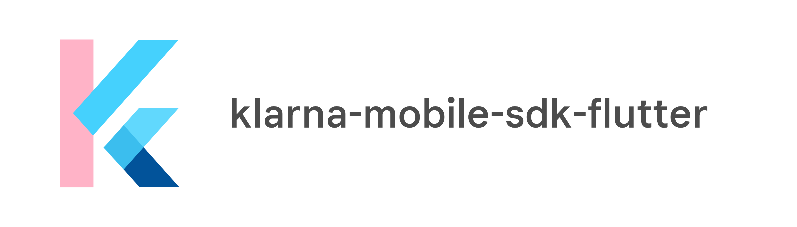

# Klarna Mobile SDK Flutter Plugin



> Klarna's Flutter wrapper for the Klarna Mobile SDK

[![License][license-image]][license-url]
[![Developed at Klarna][klarna-image]][klarna-url]

### SDK for Other Platforms

* [iOS](https://github.com/klarna/klarna-mobile-sdk-ios)
* [Android](https://github.com/klarna/klarna-mobile-sdk-android)
* [React Native](https://github.com/klarna/react-native-klarna-inapp-sdk)

## Packages

This repository is a [Pub Workspaces](https://dart.dev/tools/pub/workspaces) + [Melos](https://melos.invertase.dev/) monorepo. Each package publishes independently — see its own `README.md` for requirements, installation, and usage.

| Package | Path | Description |
| --- | --- | --- |
| `klarna_mobile_sdk_flutter` | [`packages/klarna_mobile_sdk_flutter`](./packages/klarna_mobile_sdk_flutter/README.md) | Klarna's Flutter wrapper for the native Klarna Mobile SDK (Post Purchase). |
| `klarna_network_core` | [`packages/klarna_network_core`](./packages/klarna_network_core/README.md) | Initializes and manages Klarna Network SDK sessions shared by Klarna Network packages. |

## Klarna Mobile SDK Documentation

[Overview of the SDK](https://docs.klarna.com/payments/mobile-payments/before-you-start/introduction-mobile-integrations/)

## Development

This is a Pub Workspaces + Melos monorepo; all packages resolve each other from disk.

```bash
# Resolve all workspace packages at once (Pub Workspaces)
flutter pub get

# Or via melos
dart pub global activate melos
melos bootstrap
```

Common tasks (run from the repo root):

```bash
melos run analyze       # analyze every package
melos run test          # run tests in packages that have them
melos run format        # check formatting
melos run format:fix    # apply formatting
```

Build the example app:

```bash
cd example
flutter build apk               # Android
flutter build ios --no-codesign # iOS
```

## Support

If you are having any issues using the SDK in your project or if you think that something is wrong with the SDK itself, please create an issue on [GitHub](https://github.com/klarna/klarna-mobile-sdk-flutter/issues) or report a bug by following the guidelines below.

### How can I contribute?

Thank you for reading this and taking the time to contribute to Klarna Mobile SDK! Below is a set of guidelines to help you contribute whether you want to report a bug, come with suggestions or modify code.

#### Reporting Bugs

Before submitting a bug report, please check that the issue hasn't been reported before. When creating a GitHub issue, please make sure that you:

* **Use a clear and descriptive title** for the issue.
* **Describe the exact steps which reproduce the problem** with as many details as possible.
* **Describe the behavior you observed** and **explain which behavior you expected instead** and why.
* **Provide screenshots and/or screen recordings** that might help explain the issue.
* **Include relevant logs** in the bug report.
* **Tell how recently you started having the issue** and whether it reproduces on an older version of the SDK.
* **Include device/OS details** (which OS and version, simulator/emulator or real device).

## Contribution

Before contributing, please read through the [Klarna Mobile SDK documentation](https://docs.klarna.com/payments/mobile-payments/before-you-start/introduction-mobile-integrations/).

### Branching

Prefix the branch you are going to work on depending on what you are working on:

* **feature/** for a new feature, e.g. `feature/my-shiny-feature`.
* **bugfix/** for a bug fix, e.g. `bugfix/my-bug-fix`.

### Pull Requests

When creating a PR, please include as much information as possible about the type of change (bugfix, new functionality, or other). Target the `master` branch and include:

* **A clear and descriptive title**.
* **Description of the issue** you are fixing (with a link to the relevant issue) or **background for the new feature**.

<!-- Markdown link & img dfn's -->
[license-image]: https://img.shields.io/badge/license-Apache%202-blue?style=flat-square
[license-url]: https://www.apache.org/licenses/LICENSE-2.0
[klarna-image]: https://img.shields.io/badge/%20-Developed%20at%20Klarna-black?labelColor=ffb3c7&style=flat-square&logo=
[klarna-url]: https://github.com/klarna
